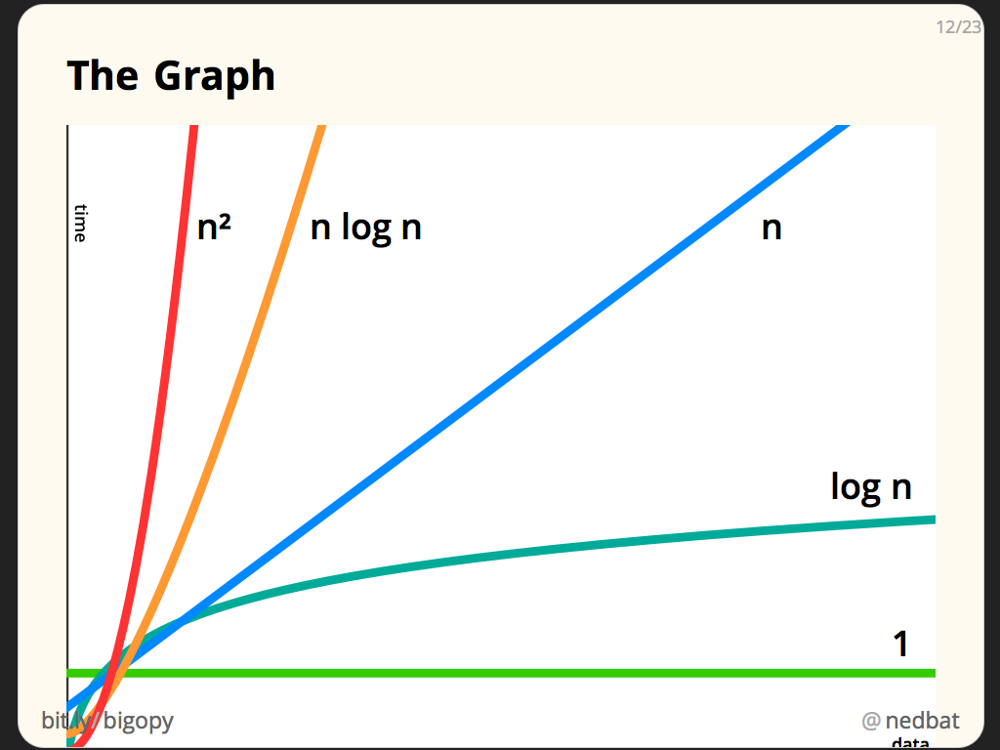

# Big-O Notation

Big-O notation helps us describe **how fast algorithms grow** as the size of the input increases. Instead of measuring actual time (which depends on the computer), we measure the **number of operations** an algorithm performs.

---

## Big-O Basic Concepts
### O(1): Constant Time

The number of operations **does not change** with the size of the input.

**Examples**
- Accessing an array/list element by its index
- Pushing/popping from the top of a stack

> **Why is it fastest?**
>
> Execution time never increases as `n` grows → perfectly flat growth.

**Coding Example:**

```
def add_items(n):
    return n + n + n
   
print add_items(10)
```

---

### O(log n): Logarithmic Time

Input is **cut in half** each step → divide-and-conquer. Each split reduces the problem exponentially.

**Examples**
- Binary search
- Operations in balanced binary trees
- Many recursive divide-and-conquer algorithms

**Growth**

Almost flat. Logarithmic growth is extremely efficient.

---

### O(n): Linear Time

Runtime grows **proportionally** with the input size. 

If n doubles → operations double.

**Examples**
- Looping through an array.

**Growth**
Proportional to the `n` and a positive linear slope 

#### Coding Example:
```
def print_items(n):
    for i in range(n):
        print(i)
```

**Explanation** 
- `def print_items(n)`: - defining a function named `print_items` that takes one parameter, `n`.
- `for i in range(n)`: - `for` loop that will iterate over a sequence of numbers from `0` up to but **not including** `n`. For each iteration, `i` takes the next value in this sequence.
- `print(i)` - prints the current value of `i` to the console.
- `print_items(10)` - call to the function `print_items` with the argument 10. 

**Output**
```
0
1
2
3
4
5
6
7
8
9
```

---

### O(n log n): Linearithmic Time
You perform a linear amount of work log n times.

**Examples**
- Merge Sort
- Heap Sort
- Quick Sort (average case)

> **Notes**
> 
> Less efficient than **O(n)**, MUCH better than **O(n²)**.

---

### O(n²): Quadratic Time

Nested loops → for each outer iteration, the inner loop runs `n` times. → Runtime grows **quadratically** as `n` increases.

**Example:**
- Bubble sort

#### Coding Example:

Print every pair (i, j) for numbers 0 to n−1
```
def print_items(n):
    for i in range(n): # Runs n times
        for j in range(n): # Runs n times for each i
            print(i,j) 

print_items(3)
```

**Explanation**
- `def print_items(n):`: a function named `print_items` that takes one input argument, `n`.
- `for i in range(n):`: loop will go from `0` up to, but **not including**, `n. Each number it generates will be temporarily stored in the variable `i`.
- `for j in range(n):`: another `for` loop inside the loop. This loop will also go from `0 to n - 1`, and each number will be temporarily stored in the variable `j`.
- `print(i,j)`: executed `n` times for each value of `i`. It prints the current values of `i` and `j` as a **pair**.

**Output**
```
0 0
0 1
0 2
1 0
1 1
1 2
2 0
2 1
2 2
```

---

## Big-O Comparison



| n    | O(1) | O(log n) | O(n) | O(n²)     |
| ---- | ---- | -------- | ---- | --------- |
| 100  | 1    | ~7       | 100  | 10,000    |
| 1000 | 1    | ~10      | 1000 | 1,000,000 |

### Why does O(n) scale better than O(n²)?
Would you like me to show you why O(n) is so steady and reliable as input size grows?

This is because as the output is proportional to the input. So let's say if I have a function that prints the number of range of inputs and I feed 10. It only prints 10 items (0 to 9) which is 10 operations. On the other hand, if we have a nested loop in a program, now instead of it printing 10 items, it prints it 100 item, significantly increasing the number of operations. If we want to look at this in a graph, the O(n) complexity graph is linear however the O(n^2) is exponential.

Goal 1: Compare time complexities for algorithms with O(n) and O(n²) using examples.
"You successfully compared time complexities using concrete examples. Your example of a function that prints a range of numbers provided a clear and practical context. Consider providing a more formal definition of time complexities alongside examples to ensure a balanced explanation. When discussing complexities, pair your examples with a brief definition to reinforce the concept."

Goal 2: Identify how nested loops result in O(n²) complexity.
"You effectively identified that nested loops increase the number of operations significantly, providing a valid explanation of how O(n²) arises. Explore discussing the specific mechanics of nested loops in more detail (e.g., inner and outer loop interactions). Define a small nested loop code example and walk through the operations step by step for more detailed clarification."

Goal3: Explain why linear algorithms (O(n)) scale better with larger inputs than quadratic algorithms (O(n²)).
"You noted the significance of scaling with larger inputs conceptually. You didn't specifically explain why linear algorithms are better for larger inputs by providing a detailed example or discussing the implications.Emphasize potential limitations of quadratic algorithms for larger datasets, and how linear algorithms perform better by requiring fewer operations."

Goal4: Predict outcomes and justify differences based on Big-O notations.
"You touched on concepts of Big-O notation when discussing graphs. You didn't explicitly make specific predictions or justify differences qualitatively or quantitatively.

Explain why linear algorithms (O(n)) scale better with larger inputs than quadratic algorithms (O(n²)). Practice making specific quantitative predictions, e.g., how many operations occur for various input sizes in example algorithms."

---

## Predicting Outcomes Using Big-O

Given an input size n:
- O(n) → n operations
- O(n²) → n² operations
- O(log n) → log₂(n) steps
- O(a + b) → a + b operations (two separate loops)
- O(a × b) → nested loops, a × b operations

**Example: O(a + b)**
```
def print_items(a, b):
    for i in range(a):
        print(i)
    for j in range(b):
        print(j)
```

**Example: O(a × b)**
```
def print_items(a, b):
    for i in range(a):
        for j in range(b):
            print(i, j)
```

---

## Big-O With Lists
### O(1) Operations

These do not require re-indexing.

| Operation   | Complexity | Why                  |
| ----------- | ---------- | -------------------- |
| `append(x)` | O(1)       | Add at end, no shift |
| `pop()`     | O(1)       | Remove last item     |

### O(n) Operations
| Operation        | Complexity | Why                    |
| ---------------- | ---------- | ---------------------- |
| `insert(0, x)`   | O(n)       | Shift every item right |
| `pop(0)`         | O(n)       | Shift items left       |
| `insert(mid, x)` | O(n)       | Shift half the list    |
| Search by value  | O(n)       | Must check each item   |
| Search by index  | O(1)       | Direct access          |

---

## Big-O, Omega, Theta

| Notation | Meaning           |
| -------- | ----------------- |
| **O()**  | Worst-case time   |
| **Ω()**  | Best-case time    |
| **Θ()**  | Average-case time |

**Examples**
- Searching in a sorted list using binary search
  - Ω(1) → best case (found in middle)
  - Θ(log n) → average
  - O(log n) → worst case

---

## Simplifying Big-O
### Drop Non-Dominant Terms

O(n² + n) → O(n²)

In O(n2 + n), focus on O(n2) as it will **dominate** for large n.

### Drop Constants

O(2n) → O(n)

As `n` gets larger, the constant gets insignificant. 

---

## Space Complexity

Measures how much **memory** an algorithm uses.

**Examples:**
- Storing n items → O(n) space
- Using only a few variables → O(1) space

Faster time does not always mean lower memory usage.

---

## Big-O Reference Chart
https://www.bigocheatsheet.com/

---
