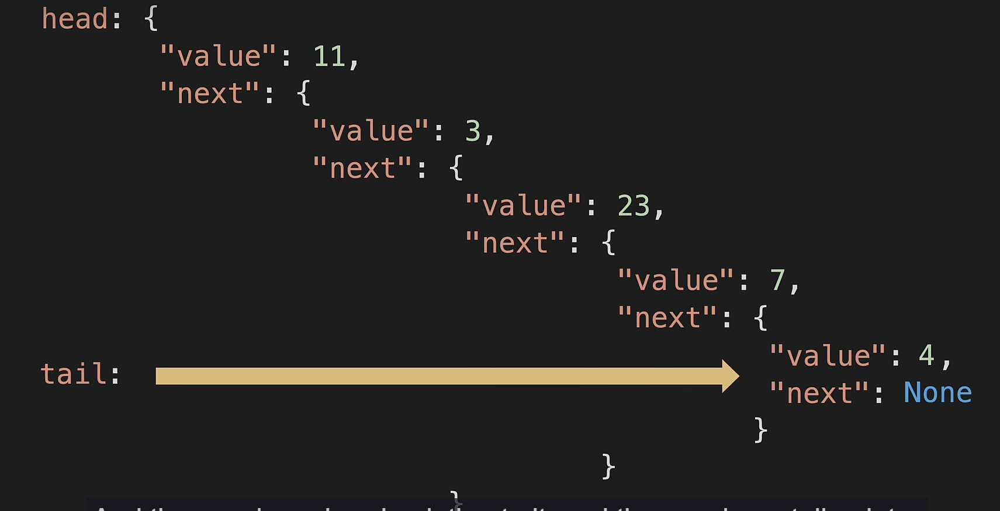

# Linked Lists 

A **Linked List** is a linear data structure where elements are stored in **nodes**, and each node points to the next one in the sequence.

Unlike Python lists (arrays), linked lists **do not use indexes** and **do not store elements contiguously in memory.**

**Components**
- **Head** → points to the first node
- **Tail** → points to the last node
- **Node** → stores a value and a reference to the next node

---

## Big-O Complexity Comparison

|**Operation**	|**Linked List**|	**Python List**|
|-----------|-----------|-------------|
|Append|	O(1)|	O(1)|
|Pop (end)|	O(n)|	O(1)|
|Prepend|	O(1)|	O(n)|
|Pop First|	O(1)	|O(n)|
|Insert|	O(n)|	O(n)|
|Remove|	O(n)|	O(n)|
|Lookup by Index|	O(n)|	O(1)|
|Lookup by Value|	O(n)|	O(n)|

---

## Under the Hood
#### What is a node? 
A node contains:
- `value`
- `next` → pointer to the next node

Conceptually, a node behaves like:
```
{
"value": 23,
"next": <reference>
}
```

To reach a value (like 23):
```
head.next.next.next.value
```

**How it happens in Code? (Rough idea)**


---

## Constructor
This section introduces the **constructor** for a singly linked list. The goal is to initialize a linked list with a single node while properly setting up internal pointers.

### Requirements

**Node Class**
- A constructor that accepts a `value`
- A `value` attribute to store data
- A `next` attribute initialized to `None` (pointer to the next node)

**LinkedList Class**
- A constructor that accepts a `value`
- Creates a new `Node` using that value
- Initializes:
  - `head` → first node
  - `tail` → last node
- Initializes `length` to `1`

### Code Implementation
```
class Node:
    def __init__(self, value):
        self.value = value
        self.next = None
            
class LinkedList:
    def __init__(self, value): 
        new_node = Node(value)
        self.head = new_node
        self.tail = new_node
        self.length = 1

my_linked_list = LinkedList(4)

print('Head:', my_linked_list.head.value)
print('Tail:', my_linked_list.tail.value)
print('Length:', my_linked_list.length)
```

### Explanation

**Node Class**
- `class Node:`: Defines the `Node` class, which represents a single element in the linked list.
- `def __init__(self, value):`: Constructor for the `Node` class called when you create a new instance.
- `self.value = value`: Stores the data passed into the node.
- `self.next = None`: Initializes the pointer to the next node as `None`. A new node does not point to anything yet.

**LinkedList Class**
- `class LinkedList:`: Defines the **LinkedList** class, which manages nodes and pointers.
- `def __init__(self, value):`: Constructor for the LinkedList class called when you create a new instance of the LinkedList class.
- `new_node = Node(value)`: Creates the first node in the linked list.
- `self.head = new_node`: Sets the head of the list to the new node.
- `self.tail = new_node`: Sets the tail of the list to the same node. Since the list has only one node, head and tail point to the same location in memory.
- `self.length = 1`: Tracks the number of nodes in the list. Starts at 1 because one node exists.

**Output**
```
Head: 4
Tail: 4
Length: 1
```

---

## Print list
The `print_list` method allows you to **traverse the linked list** and print the value of each node from `head` to `tail`.

This method is useful for debugging and understanding how nodes are connected.

### Requirements
- Start from the `head` node
- Traverse using the `next` pointer
- Print each node's value
- Stop when the current node becomes `None`

### Code Implementation 
```
def print_list(self):
    temp = self.head
    while temp is not None:
        print(temp.value)
        temp = temp.next

print_this_list = LinkedList(10)
print_this_list.print_list()
```

### Explanation
- `temp = self.head` → Start traversal at the first node
- `while temp is not None:` → Continue until the end of the list
- `print(temp.value)` → Print the current node's value
- `temp = temp.next` → Move to the next node

### Output
```
10
```

### Time Complexity

`O(n)` → Every node is visited once

---

## Append
The `append` method adds a **new node to the end** of the linked list. This is an efficient operation because we maintain a `tail` pointer.

### Requirements
- Handle the cases where the list is empty
- Create a new `node`
- Update the current tail's `next` pointer
- Move the `tail` reference to the new node
- Increment `length`

### Code Implementation
```
def append(self, value):
    new_node = Node(value)
    
    if self.length == 0: # empty list
        self.head = new_node # t
        self.tail = new_node
    else:
        self.tail.next = new_node
        self.tail = new_node
    self.length += 1

append_list = LinkedList(10)
append_list.append(3)
append_list.append(23)

append_list.print_list()
```

### Explanation
- `new_node = Node(value)` → Create a new node
- `if self.length == 0:` → Check if the linked list is empty
  - If the LL is empty, set the `head` and `tail` to point at `new_node`
- `self.tail.next = new_node` → Update the next attribute
- `self.tail = new_node` → set tail to point to new_node
- `self.length += 1` → Increment the length of the linked list by 1

### Output
```
10
3
23
```

### Time Complexity

`O(1)` → No matter how large the linked list is, the number of operations taken to execute append remains constant

---

## Pop
The `pop` method should remove the last node (`tail`) from the linked list and return the removed node. If the list is **empty**, the method should return `None`.

### Requirements
- Handle the cases where the list is empty, has only one node, or has multiple nodes
- Update the `tail` attribute
- Update the `length` attribute
- Return either the removed node or `None` if the list is **empty**.

### Code Implementation
```
def pop(self):
        if self.tail == None: # empty list
            return None
        elif self.head == self.tail: # only one item in the list
            node = self.tail
            self.head = None
            self.tail = None
            self.length = 0
            return node
        
        node = self.tail
        temp = self.head
        pre = self.head
        while temp.next is not None:
            pre = temp
            temp = temp.next
            
        self.tail = pre
        self.tail.next = None
        
        self.length -= 1
        return node  

popped_list = LinkedList(10)
popped_list.append(3)
popped_list.append(23)
popped_node = popped_list.pop()

print("Popped Node: ", popped_node.value)
popped_list.print_list()
```

### Explanation
- `if self.tail == None` → List is empty, return None
- `elif self.head == self.tail:` → Only one item in the list, set head and tail to `None`, length to `0` and return the `node`. 
- `temp = self.head`, `pre = self.head` → Both pointing to the head
- `while temp.next is not None:` → Loops as long as the next attribute of temp is not `None`. `pre` stores the second-to-last node and `temp` stores the last node. 
- `self.tail = pre`, `self.tail.next = None` → tail is updated to the second-to-last node, and it's next attribute is set to `None`. 
- `self.length -= 1`, `return node` → decrements the length and returns the node

### Output
```
Popped Node:  23
10
3
```

### Time Complexity

`O(n)` → n is the number of nodes in the linked list

---

## Prepend
The `prepend` method should add a new node with a given value to the **beginning** of the linked list, updating the head attribute and the length attribute accordingly.

### Requirements
- Handle the cases where the list is empty, has only one node, or has multiple nodes
- Create a new node with the given value and add it to the beginning of the list
- Update the `head` attribute
- Update the `length` attribute
- Return `True` if the operation is successful.

### Code Implementation
```
def prepend(self, value):
    new_node = Node(value)
    if self.length == 0: # empty List
        self.head = new_node
        self.tail = new_node
    else: # not empty
        temp = self.head
        self.head = new_node
        self.head.next = temp
    self.length += 1
    return True
    
prepend_list = LinkedList(2)
prepend_list.append(3)
print(prepend_list.prepend(1))
prepend_list.print_list()
```

### Explanation
- `if self.length == 0:` → List is empty, set the head and tail to the new node
- `temp = self.head`, `self.head = new_node`, `self.head.next = temp` → Runs when list is not empty. `temp` stores the current head of the list. `head` now stores `new_node` and the `next` attribute is pointing to `temp` (previously head) .

### Output
```
True
1
2
3
```

### Time Complexity

`O(1)` → Constant Time

---

## Pop First
The `pop_first` method removes the first node (the head) from the linked list, update the head attribute and the length attribute accordingly, and return the removed node.

### Requirements
- Handle the cases where the list is empty, has only one node, or has multiple nodes
- Save a reference to the current head node before updating the head attribute
- Update the `head` attribute
- Update the `length` attribute
- If the list becomes empty after removing the node, set the `tail` attribute to `None`
- Return either the removed node or `None` if the list is **empty**.

### Code Implementation
```
def pop_first (self):
        node = self.head
        if self.length == 0: # empty list   
            return None
        elif self.length == 1: # only Item
            self.head = None
            self.tail = None
        else: 
            next_node = node.next
            self.head = next_node
            node.next = None
        self.length -= 1
        return node
        
pop_first_list = LinkedList(10)
pop_first_list.append(3)
pop_first_list.append(4)
popped_first_node = pop_first_list.pop_first()

print("Popped First Node: ", popped_first_node.value)
pop_first_list.print_list()
```

### Explanation
- `next_node = node.next` → Saves a reference to the second node
- `self.head = next_node` → update the head to the second node
- `node.next = None` → set the next attribute of the previous head to None

### Output
```
Popped First Node:  10
3
4
```

### Time Complexity

`O(1)` → Constant Time

---

## Get
The `get` method should take an integer index as a parameter and return a pointer to the node at the specified index in the linked list.

### Requirements
- Handle the cases where the index is **out of bounds**.
- Start at the `head` of the list
- Traverse using the `next` pointer
- Stop traversing the list when it reaches the specified index and return the node at that position
- If the index is out of bounds, the method should return `None`

### Code Implementation
```
def get(self, index):
    if index < 0 or index >= self.length:
        return None
    
    temp = self.head
    for i in range(index): 
        temp = temp.next
        
    return temp

get_list = LinkedList(0)
get_list.append(1)
get_list.append(2)
get_list.append(3)

print(get_list.get(3).value)
```

### Explanation
- `if index < 0 or index >= self.length:` → Index Out of Bounds
- `temp = self.head` → start at the head
- `for i in range(index):` → starts traversing until the index. 
- `temp = temp.next` → Move to the next node. By the end of the loop, `temp` stores the `node` at `index`. 

### Output
```
3
```

### Time Complexity

`O(n)` → Every node is visited once

---

## Set
The `set_value` method should take an integer index and a value as parameters and update the value of the node at the specified index in the linked list.

### Requirements
- Handle the cases where the index is **out of bounds**.
- Utilize the `get` method to find the node at the specified index.
- Update the value of the node if the node is found.
- Stop traversing the list when it reaches the specified index and return the node at that position
- If the index is out of bounds, the method should return `False`. Return `True` is successful. 

### Code Implementation
```
def set_value (self, index, param):
    if index < 0 or index >= self.length:
        return False
    
    node = self.get(index)
    node.value = param
    return True
    
set_list = LinkedList(11)
set_list.append(3)
set_list.append(23)
set_list.append(7)
set_list.set_value(1,4)

set_list.print_list()    
```

### Explanation
- `if index < 0 or index >= self.length:` → Index Out of Bounds
- `node = self.get(index)` → get the node at that index using `get` method
- `node.value = param` → change the value

### Output
```
11
4
23
7
```

### Time Complexity

`O(n)` → Every node is visited once

---

## Insert
  The insert method should take an integer index and a value as parameters and insert a new node with the given value at the specified index in the linked list.

### Requirements
- Handle the cases where the index is **out of bounds** and edge cases, such as inserting a new node at the beginning or end of the list
- Utilize the `prepend`, `append`, and `get` methods
- Create a new `node` with the given value and insert it at the specified index
- Update the `next` attribute
- Increment the `length` attribute
- If the index is out of bounds, the method should return `False`. Return `True` is successful

### Code Implementation
```
def insert(self, index, value):
    if index < 0 or index > self.length: # Index Out of Bounds
        return False
    elif index == 0: # Add node at the beginning 
        self.prepend(value)
    elif index == (self.length): # Add node at the end 
        self.append(value)
    else: # Add node in the middle
        pre_node = self.get(index - 1)
        post_node = self.get(index)
        new_node = Node(value)
        pre_node.next = new_node
        new_node.next = post_node
        self.length += 1
        
    return True

insert_list = LinkedList(1)
insert_list.append(3)
insert_list.insert(1,2)
insert_list.insert(0,0)
insert_list.insert(4,4)

insert_list.print_list()
```

### Explanation
- `pre_node = self.get(index - 1)`, `post_node = self.get(index)` → Store the reference to the nodes before and after the index. 
- `new_node = Node(value)` → Create a new node
- `pre_node.next = new_node`, `new_node.next = post_node` → Set the next attributes

### Output
```
0
1
2
3
4
```

### Time Complexity

`O(n)` → Every node is visited once

---

## Remove
The remove method should take an integer index as a parameter and remove the node at the specified index in the linked list, returning the removed node.

### Requirements
- Handle the cases where the index is **out of bounds** and edge cases, such as removing a node at the beginning or end of the list
- Utilize the `pop_first`, `pop`, and `get` methods
- Update the `next` attribute
- Decrement the `length` attribute
- If the index is out of bounds, the method should return `None`. Return the removed node if successful

### Code Implementation
```
def remove (self, index):
    if index < 0 or index >= self.length: # Index Out Of Bounds
        return None
    elif index == 0: # Remove First Node
        return self.pop_first()
    elif index == self.length - 1: # Remove Last Node
        return self.pop()
    
    node = self.get(index)
    pre_node = self.get(index - 1)
    pre_node.next = node.next
    node.next = None
    self.length -= 1
    
    return node
    
remove_list = LinkedList(1)
remove_list.append(2)
remove_list.append(3)
remove_list.append(4)
remove_list.append(5)

print('Removed node (middle):')
print(remove_list.remove(2).value)
print('Removed node (first):')
print(remove_list.remove(0).value)
print('Removed node (last):')
print(remove_list.remove(2).value)
print('Full list:')
remove_list.print_list()     
```

### Explanation
- `node = self.get(index)`, `pre_node = self.get(index - 1)` → Get the node and the node **before** that index
- `pre_node.next = node.next` → Connect the next attributes
- `node.next = None` → Disconnect the next attribute of the node to be removed

### Output
```
Removed node (middle):
3
Removed node (first):
1
Removed node (last):
5
Full list:
2
4
```

### Time Complexity

`O(n)` → Every node is visited once

---

## Reverse
The `reverse` method should reverse the order of the nodes in the linked list so that the `head` becomes the `tail` and the `tail` becomes the `head`.

### Requirements
- Handle edge cases, such as an empty list or a list with a single node
- Do not create any new nodes or modify the values of the nodes
- Only update the next attribute of each node
- Utilize a temporary variable to swap the head and tail attributes

### Code Implementation
```
def reverse (self):
    if self.length > 1: # Run this if list has more than one node
        temp = self.head # Store the head
        self.head = self.tail # Set head to tail 
        self.tail = temp # Set tail to head (temp stored head)
        
        after = temp.next 
        before = None
        
        for _ in range(self.length):
            after = temp.next
            temp.next = before
            before = temp
            temp = after

reverse_list = LinkedList(1)
reverse_list.append(2)
reverse_list.append(3)
reverse_list.append(4)
reverse_list.reverse()

print('LL after reverse():')
reverse_list.print_list()
```

### Explanation
- `after = temp.next`, `before = None` → Store the next and previous node so that we can switch them
- `for _ in range(self.length):` → loop until the end of the list. `_` is used because we ignore or discard the variable
- `after = temp.next` → Store the next node in the list after the current node (temp) in the after variable
- `temp.next = before` → Update the next pointer of the current node (temp) to point to the previous node in the list (before)
- `before = temp` → Update the previous node (before) to be the current node (temp)
- `temp = after` →  Move the current node (temp) to the next node in the list (after)

### Output
```
4
3
2
1
```

### Time Complexity

`O(n)` → Every node is visited once

---
