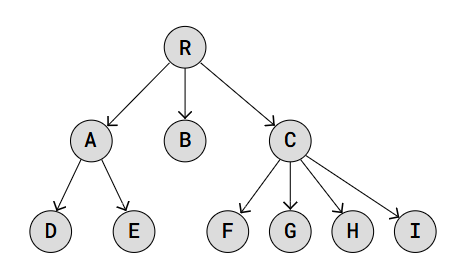
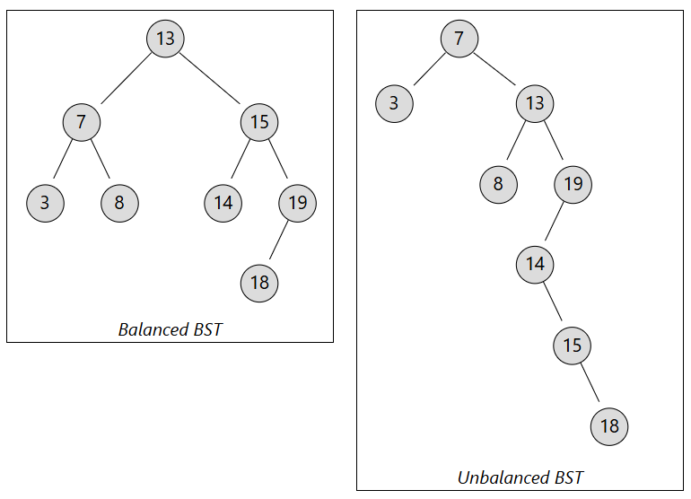
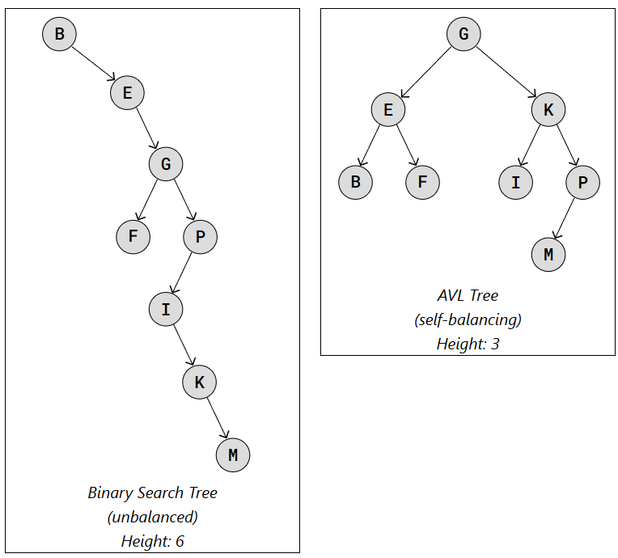
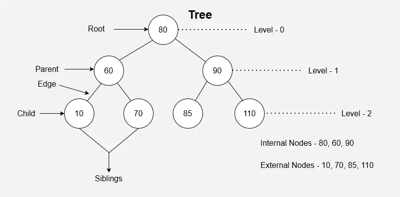
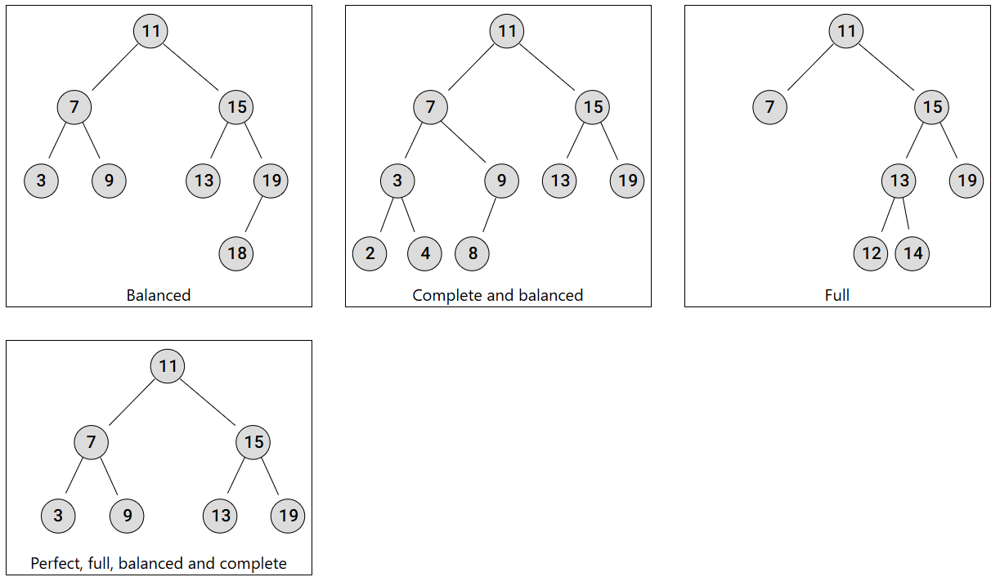

# Trees

A **tree** is a hierarchical data structure consisting of nodes connected by edges. Each node contains a value and
references to its child nodes.

It is very similar to **Linked Lists** in that each node contains data and can be linked to other nodes.

The data structure is called a "tree" because it looks like a tree's structure.


### Types of Trees:

- **Binary Trees:** Each node has up to two children, the left child node and the right child node. This structure is
  the foundation for more complex tree types like **Binary Search Trees** and **AVL Trees**.
  
- **Binary Search Trees (BSTs)**: A type of Binary Tree where for each node, the left child node has a lower value, and
  the right child node has a higher value.
  
- **AVL Trees**: A type of Binary Search Tree that self-balances so that for every node, the difference in height
  between the left and right subtrees is at most one. This balance is maintained through rotations when nodes are
  inserted or deleted.
  

### Some Important Terminology:

- **Node**: Each item in the tree.
- **Root Node**: The single node at the very top of the tree, which has no parent.
- **Child Node**: A node that has an immediate predecessor (parent).
- **Sibling Nodes**: Nodes that share the same parent.
- **Leaf Node**: A node that does not have any child nodes.
- **Balanced Tree**: At most 1 in difference between its left and right subtree heights, for each node in the tree.
- **Complete Tree**: All levels full of nodes, except the last level, which is can also be full, or filled from left to
  right. It is also balanced.
- **Full Tree**: Each node points to zero nodes or two nodes.
- **Perfect Tree**: All leaf nodes on the same level, which means that all levels are full of nodes, and all internal
  nodes have two child nodes. The tree is also full, balanced, and complete.




### BST: Big O

The Big O complexity of BinaryS each Tree (BST) operations varies depending on whether the tree is balanced or not. In a
balanced BST (average and best cases), operations are efficient due to its logarithmic height, while an unbalanced BST
can degrade to a linear, linked-list-like structure in the worst case.

| **Operation**        | **Average Case (Balanced BST)** | 	**Worst Case (Unbalanced BST)** | **Linked Lists** |
|----------------------|---------------------------------|----------------------------------|------------------|
| **Search/Lookup**    | 	`O(log n)`                     | 	`O(n)`                          | `O(n)`           |
| **Insertion**        | `O(log n)`	                     | `O(n)`                           | `O(1)`           |
| **Deletion**         | 	`O(log n)`	                    | `O(n)`                           | `O(n)`           |
| **Space Complexity** | 	`O(n)`                         | 	`O(n)`                          | `O(n)`           |

---

## Constructor

This section introduces the **constructor** for a BST. The goal is to initialize a BST with a
root.

### Requirements

**Node Class**

- A constructor that accepts a `value`
- A `value` attribute to store data
- A `left` attribute initialized to `None` (pointer to the left child node)
- A `right` attribute initialized to `None` (pointer to the right child node)

**BinarySearchTree Class**

- A constructor that initializes an empty binary search tree
- Initializes:
    - `root ` → None

### Code Implementation

```
class Node:
    def __init__(self, value):
        self.value = value
        self.left = None
        self.right = None
        

class BinarySearchTree:
    def __init__(self):
        self.root = None
```

### Explanation

**Node Class**

- `class Node:`: Defines the `Node` class, which represents a single element in the linked list.
- `def __init__(self, value):`: Constructor for the `Node` class called when you create a new instance.
- `self.value = value`: Stores the data passed into the node.
- `self.left = None`: Initializes the pointer to the left child node as `None`.
- `self.right = None`: Initializes the pointer to the right child node as `None`. 

**BinarySearchTree  Class**

- `class BinarySearchTree:`: Defines the **BST** class, which manages nodes and pointers.
- `def __init__(self):`: Constructor for the BST class called when you create a new instance of the
  BinarySearchTree class.
- `self.root = None`: Sets the root to None, indicating that the tree is initially empty.

---

## Insert

The `insert ` method adds a **new node** with a given value into the binary search tree.

### Requirements

- Handle the cases where the BST is empty
- Create a new `node`
- Return False if a node with that value already exists
- Add the new node to the left or right according to the value of the parent at that node
- Return True if successful

### Code Implementation

```
def insert(self, value):
    new_node = Node(value)
    if (self.root is None):
        self.root = new_node
        return True
        
    temp = self.root
    while(temp):
        if (temp.value == value): # Duplicate
            return False
        elif (new_node.value < temp.value): # Less than (left)
            if(temp.left is None): 
                temp.left = new_node
                return True
            else:
                temp = temp.left
        else: # Greater than (right)
            if(temp.right is None): 
                temp.right = new_node
                return True
            else:
                temp = temp.right
```

### Explanation

- `new_node = Node(value)` → Create a new node.
- `if (self.root is None):` → Check if the BST is empty.
    - If the BST is empty, set the `root` to point at `new_node`, and return True.
- `temp = self.root` → Set the temp variable to point at the root.
- `while(temp):` → Run this loop as long as temp is not None.
- `if (temp.value == value): # Duplicate` → If temp value is equal to the value of the new node, return False. 
- `elif (new_node.value < temp.value): # Less than (left)` → If the value is less than.
  - `if(temp.left is None):` → If the temp's left child is empty (None), set that left node to point to the new node. Return True.
  - `temp = temp.left` → Otherwise, move to the left node. 
- `else: # Greater than (right)` → If the value is greater than.
  - `if(temp.right is None):` → If the temp's right child is empty (None), set that right node to point to the new node. Return True.
    - `temp = temp.right` → Otherwise, move to the right node.

---

## Contains

The `contains` method should check if a node with a given value exists in the binary search tree.

### Requirements

- Handle the cases where the BST is empty
- Return True if that node exists, False otherwise
- Traverse the BST left or right by comparing the node value with the given value. 

### Code Implementation

```
def contains(self, value):
    temp = self.root
    while(temp):
        if (temp.value == value): # Value exists
            return True
        elif (value < temp.value): # go left
            temp = temp.left
        else: # go right
            temp = temp.right
    
    return False
```

### Explanation

- `temp = self.root` → Set the temp variable to point at the root.
- `while(temp):` → Run this loop as long as temp is not None.
- `if (temp.value == value): # Value exists` → If temp value is equal to the value of the new node, return True.
- `elif (value < temp.value): # go left` → If the value is less than.
  - `temp = temp.left` → Move to the left node.
- `else: # go right` → If the value is greater than.
  - `temp = temp.right` → Move to the right node.
- Return False since the value was not found. 

---