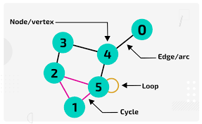
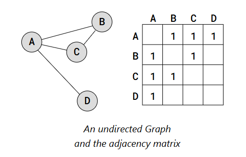
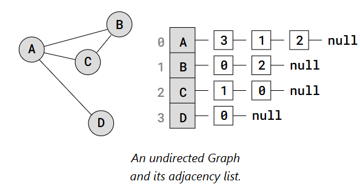

# Graph

A Graph is a non-linear data structure that consists of vertices (nodes) and edges. They are non-linear because the data structure allows us to have **different** paths to get from one vertex to another, unlike with linear data structures like **Arrays** or **Linked Lists**.

A **vertex**, also called a node, is a point or an object in the Graph, and an **edge** is used to connect two vertices with each other. 

In a **weighted** edge graph, each edge is assigned a numerical value (weight) representing cost or time between vertices. Unlike **unweighted** graphs, these models allow for finding optimal paths (shortest/fastest) using algorithms like **Dijkstra's** or finding minimum spanning trees. 

These edges can also either have a **directional** edge _(only pointing in one direction)_ or **bi-directional** edges _(pointing in both direction)_. 



---

## Graph Representations

A Graph representation tells us how a Graph is stored in memory.

Different Graph representations can:
- take up more or less space.
- be faster or slower to search or manipulate.
- be better suited depending on what type of Graph we have (weighted, directed, etc.), and what we want to do with the Graph.
- be easier to understand and implement than others.

### Adjacency Matrix: 
The Adjacency Matrix is a 2D array (matrix) where each cell on index (i,j) stores information about the edge from vertex i to vertex j.

Below is a Graph with the Adjacency Matrix representation next to it.



### Adjacency List:
An Adjacency List has an array that contains all the vertices in the Graph, and each vertex has a Linked List (or Array) with the vertex's edges. It is often represented with a dictionary. 



### Big O:

#### Space Complexity: 

| **Representation** | Space Complexity | Notes                                      |
|--------------------|------------------|--------------------------------------------|
| Adjacency Matrix   | `O(V²)`          | Stores all edges, including non-edges as 0 |
| Adjacency List     | `O(V + E)`       | Stores only existing edges                 |

#### Time Complexity:
| Operation         | Adjacency Matrix | Adjacency List |
| ----------------- | ---------------- | -------------- |
| Add Vertex        | `O(V²)`            | `O(1)`           |
| Add Edge          | `O(1)`             | `O(1)`           |
| Remove Edge       | `O(1)`             | `O(E)`           |
| Remove Vertex     | `O(V²)`            | `O(V + E)`       |
| Check Edge Exists | `O(1)`             | `O(E)`           |

---

## Add Vertex
The method should perform the following tasks:
- Accept a parameter `vertex` that represents the vertex to be added to the graph.
- Check if the vertex is not already present in the adjacency list `adj_list` (an attribute of the Graph class):
  - If the vertex is not present, add it as a key to the `adj_list` dictionary with an empty list as its value.
  - Return True to indicate that the vertex was successfully added to the graph.
- If the vertex is already present in the `adj_list`, return False to indicate that the operation was unsuccessful.

### Code Implementation
```
class Graph:
    def __init__(self):
        self.adj_list = {}

    def print_graph(self):
        for vertex in self.adj_list:
            print(vertex, ':', self.adj_list[vertex])

    def add_vertex(self, vertex):
        if vertex not in self.adj_list:
            self.adj_list[vertex] = []
            return True
        return False
```

### Explanation

- Check if the vertex is not already in the graph. 
  - Add it as a new key in the adj_list.
  - Return True.
- Return False.

---

## Add Edge
Write a method called `add_edge` to the Graph class that adds a new edge between two vertices in the graph's adjacency list.

The method should take two parameters `v1` and `v2`, which are the vertices that the edge should be added between. The method should first check that both vertices are present in the `adj_list` dictionary, and if they are, it should add both vertices to each other's adjacency list as new edges.

### Code Implementation
```
def add_edge (self, v1, v2):
    if v1 in self.adj_list.keys() and v2 in self.adj_list.keys(): 
        self.adj_list[v1].append(v2)
        self.adj_list[v2].append(v1)
        return True
    return False
```

### Explanation
- Check if both the vertices is already in the graph.
    - Append the first vertex to the other and vice versa.
    - Return True.
- Return False.

---

## Remove Edge
Write a method called `remove_edge` that removes an edge between two vertices in the graph's adjacency list.

### Code Implementation
```
def remove_edge(self, v1, v2):
    if v1 in self.adj_list.keys() and v2 in self.adj_list.keys():
        try: 
            self.adj_list[v1].remove(v2)
            self.adj_list[v2].remove(v1)
        except ValueError:
            pass
        return True
    return False 
```

### Explanation
- Check if both the vertices is already in the graph.
    - Try.
      - Remove the first vertex to the other and vice versa.
    - If either v1 or v2 is not present in the adjacency list.
      - Do nothing.
    - Return True.
- Return False.

---

## Remove Vertex
The `remove_vertex` method takes a vertex as input and removes it from the graph, along with all edges connected to it.

The method returns `True` if the vertex was successfully removed and `False` if the vertex was not present in the graph.

### Code Implementation
```
def remove_vertex (self, vertex):
    if vertex in self.adj_list.keys():
        for other_vertex in self.adj_list[vertex]:
            self.adj_list[other_vertex].remove(vertex)
        del self.adj_list[vertex]
        return True
        
    return False
```

### Explanation
- Check if the vertex is in the graph.
    - Loop over all vertices adjacent to the vertex to be removed. 
      - Remove the vertex to be removed from the list of adjacent vertices of the other vertices. 
      - After removing all the edges, remove the vertex from the adjacency list. 
      - Return True.
- Return False.

---

_source: https://www.w3schools.com/python/python_dsa_graphs.asp_

---


